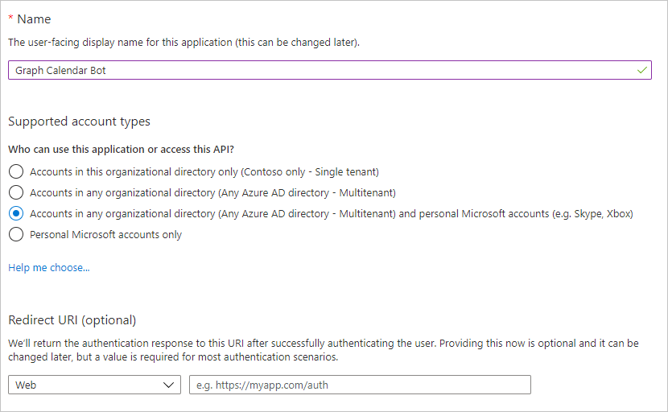

<!-- markdownlint-disable MD002 MD041 -->

Neste exercício, você criará um novo registro de canais de bot e um registro de aplicativo Web do Azure AD usando o portal do Azure.

## Criar um registro de canais de bot

1. Abra um navegador e navegue até o [portal do Azure](https://portal.azure.com). Faça logon usando a conta associada à sua assinatura do Azure.

1. Selecione o menu superior esquerdo e, em seguida, selecione **criar um recurso**.

    

1. Na **nova** página, procure `Bot Channel` e selecione o **registro de canais de bot**.

1. Na página **registro de canais de bot** , selecione **criar**.

1. Preencha os campos obrigatórios e deixe **ponto de extremidade de mensagem** em branco. O campo **identificador de bot** deve ser exclusivo. Certifique-se de revisar as diferentes camadas de preços e selecionar o que faz sentido para o seu cenário. Se este é apenas um exercício de aprendizagem, talvez você queira selecionar a opção gratuito.

1. Selecione a **ID e a senha do aplicativo Microsoft e**, em seguida, selecione **criar novo**.

1. Selecione **criar ID de aplicativo no portal de registro de aplicativo**. Isso abrirá uma nova janela ou guia na folha de **registros de aplicativos** no portal do Azure.

1. Na folha **registros de aplicativos** , selecione **novo registro**.

1. Defina os valores da seguinte maneira.

    - Defina **Nome** para `Graph Calendar Bot`.
    - Defina **Tipos de conta com suporte** para **Contas em qualquer diretório organizacional e contas pessoais da Microsoft**.
    - Deixe o **URI de Redirecionamento** vazio.

    

1. Selecione **Registrar**. Na página **bot Calendar do gráfico** , copie o valor da **ID do aplicativo (cliente)** e salve-o, você precisará deles nas etapas a seguir.

    

1. Selecione **Certificados e segredos** sob **Gerenciar**. Selecione o botão **Novo segredo do cliente**. Insira um valor em **Descrição** e selecione uma das opções para **expirar** e selecione **Adicionar**.

1. Copie o valor secreto do cliente antes de sair desta página. Você precisará dela nas etapas a seguir.

    > [!IMPORTANT]
    > Este segredo do cliente nunca é mostrado novamente, portanto, copie-o agora. Você precisará inserir esse valor em vários lugares para mantê-lo seguro.

1. Retorne à janela de registro do canal de bot no navegador e cole a ID do aplicativo no campo **ID do aplicativo da Microsoft** . Cole o segredo do cliente no campo **senha** . Selecione **OK**.

1. Na página **registro de canais de bots** , selecione **criar**.

1. Aguarde até que o registro de canais de bot seja criado. Depois de criado, retorne à Home Page no portal do Azure e selecione **serviços de bot**. Selecione seu novo registro de canal de bots para exibir suas propriedades.

## Criar um registro de aplicativo Web

1. Retorne à seção **registros de aplicativos** do portal do Azure.

1. Selecione **Novo registro**. Na página **Registrar um aplicativo**, defina os valores da seguinte forma.

    - Defina **Nome** para `Graph Calendar Bot Auth`.
    - Defina **Tipos de conta com suporte** para **Contas em qualquer diretório organizacional e contas pessoais da Microsoft**.
    - Em **URI de Redirecionamento**, defina o primeiro menu suspenso para `Web` e defina o valor como `https://token.botframework.com/.auth/web/redirect`.

1. Selecione **Registrar**. Na página **autenticação de bot de calendário do gráfico** , copie o valor da **ID do aplicativo (cliente)** e salve-o, você precisará deles nas etapas a seguir.

1. Selecione **Certificados e segredos** sob **Gerenciar**. Selecione o botão **Novo segredo do cliente**. Insira um valor em **Descrição** e selecione uma das opções para **expirar** e selecione **Adicionar**.

1. Copie o valor secreto do cliente antes de sair desta página. Você precisará dela nas etapas a seguir.

1. Selecione **permissões de API** e, em seguida, selecione **Adicionar uma permissão**.

1. Selecione **Microsoft Graph** e, em seguida, selecione **permissões delegadas**.

1. Selecione as permissões a seguir e, em seguida, selecione **adicionar permissões**.

    - **openid**
    - **perfil**
    - **Calendars.ReadWrite**
    - **MailboxSettings.Read**

    

### Sobre permissões

Considere o que cada um desses escopos de permissão permite que o bot faça e o que o bot utilizará para eles.

- **OpenID** e **Profile**: permite ao bot assinar usuários e obter informações básicas do Azure AD no token de identidade.
- **Calendars. ReadWrite**: permite que o bot Leia o calendário do usuário e adicione novos eventos ao calendário do usuário.
- **MailboxSettings. Read**: permite que o bot Leia as configurações da caixa de correio do usuário. O bot usará isso para obter o fuso horário selecionado do usuário.
- **User. Read**: permite ao bot obter o perfil do usuário do Microsoft Graph. O bot usará isso para obter o nome do usuário.

## Adicionar conexão OAuth ao bot

1. Navegue até a página de registro dos canais de bot do bot no portal do Azure. Selecione **configurações** em **Gerenciamento de bot**.

1. Em **configurações de conexão OAuth** próximo à parte inferior da página, selecione **Adicionar configuração**.

1. Preencha o formulário da seguinte maneira e selecione **salvar**.

    - **Nome**: `GraphBotAuth`
    - **Provedor**: **Azure Active Directory v2**
    - **ID do cliente**: a ID do aplicativo do seu registro de **autenticação do bot de calendário do gráfico** .
    - **Segredo do cliente**: o segredo do cliente do registro de **autenticação do bot de calendário do gráfico** .
    - **URL do token do Exchange**: deixar em branco
    - **ID do locatário**: `common`
    - **Escopos**: `openid profile Calendars.ReadWrite MailboxSettings.Read User.Read`

1. Selecione a entrada **GraphBotAuth** em **configurações de conexão OAuth**.

1. Selecione **testar conexão**. Isso abre uma nova janela ou guia do navegador para iniciar o fluxo do OAuth.

1. Se necessário, entre. Revise a lista de permissões solicitadas e selecione **aceitar**.

1. Você verá uma mensagem de **teste de conexão com êxito em ' GraphBotAuth '** .

> [!TIP]
> Você pode selecionar o botão **copiar token** nesta página e colar o token em [https://jwt.ms](https://jwt.ms) para ver as declarações dentro do token. Isso é útil na solução de problemas de erros de autenticação.
