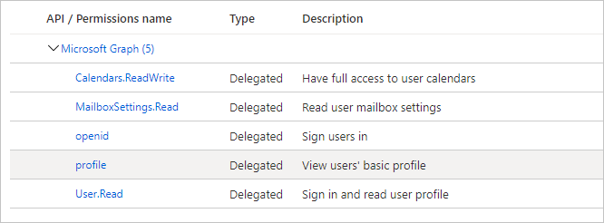

<!-- markdownlint-disable MD002 MD041 -->

Neste exercício, você criará um novo registro de canais de bot e um registro de aplicativo Web do Azure AD usando o portal do Azure.In this exercise, you will create a new Bot Channels registration and an Azure AD web application registration using the Azure Portal.

## Criar um registro de canais de botCreate a Bot Channels registration

1. Abra um navegador e navegue até o [portal do Azure](https://portal.azure.com).Open a browser and navigate to the [Azure Portal](https://portal.azure.com). Faça logon usando a conta associada à sua assinatura do Azure.Login using the account associated with your Azure subscription.

1. Selecione o menu superior esquerdo e, em seguida, selecione **criar um recurso**.Select the upper-left menu, then select **Create a resource**.

    

1. Na **nova** página, procure `Bot Channel` e selecione o **registro de canais de bot**.On the **New** page, search for `Bot Channel` and select **Bot Channels Registration**.

1. Na página **registro de canais de bot** , selecione **criar**.On the **Bot Channels Registration** page, select **Create**.

1. Preencha os campos obrigatórios e deixe **ponto de extremidade de mensagem** em branco.Fill in the required fields, and leave **Messaging endpoint** blank. O campo **identificador de bot** deve ser exclusivo.The **Bot handle** field must be unique. Certifique-se de revisar as diferentes camadas de preços e selecionar o que faz sentido para o seu cenário.Be sure to review the different pricing tiers and select what makes sense for your scenario. Se este é apenas um exercício de aprendizagem, talvez você queira selecionar a opção gratuito.If this is just a learning exercise, you may want to select the free option.

1. Selecione a **ID e a senha do aplicativo Microsoft e**, em seguida, selecione **criar novo**.Select the **Microsoft App ID and password**, then select **Create New**.

1. Selecione **criar ID de aplicativo no portal de registro de aplicativo**.Select **Create App ID in the App Registration Portal**. Isso abrirá uma nova janela ou guia na folha de **registros de aplicativos** no portal do Azure.This will open a new window or tab to the **App registrations** blade in the Azure Portal.

1. Na folha **registros de aplicativos** , selecione **novo registro**.In the **App registrations** blade, select **New registration**.

1. Defina os valores da seguinte maneira.Set the values as follows.

    - Defina **Nome** para `Graph Calendar Bot`.Set **Name** to `Graph Calendar Bot`.
    - Defina **Tipos de conta com suporte** para **Contas em qualquer diretório organizacional e contas pessoais da Microsoft**.Set **Supported account types** to **Accounts in any organizational directory and personal Microsoft accounts**.
    - Deixe o **URI de Redirecionamento** vazio.Leave **Redirect URI** empty.

    

1. Selecione **Registrar**.Select **Register**. Na página **bot Calendar do gráfico** , copie o valor da **ID do aplicativo (cliente)** e salve-o, você precisará deles nas etapas a seguir.On the **Graph Calendar Bot** page, copy the value of the **Application (client) ID** and save it, you will need it in the following steps.

    

1. Selecione **Certificados e segredos** sob **Gerenciar**.Select **Certificates & secrets** under **Manage**. Selecione o botão **Novo segredo do cliente**.Select the **New client secret** button. Insira um valor em **Descrição** e selecione uma das opções para **expirar** e selecione **Adicionar**.Enter a value in **Description** and select one of the options for **Expires** and select **Add**.

1. Copie o valor secreto do cliente antes de sair desta página.Copy the client secret value before you leave this page. Você precisará dela nas etapas a seguir.You will need it in the following steps.

    > [!IMPORTANT]
    > Este segredo do cliente nunca é mostrado novamente, portanto, copie-o agora.This client secret is never shown again, so make sure you copy it now. Você precisará inserir esse valor em vários lugares para mantê-lo seguro.You will need to enter this value in multiple places so keep it safe.

1. Retorne à janela de registro do canal de bot no navegador e cole a ID do aplicativo no campo **ID do aplicativo da Microsoft** .Return to the Bot Channel Registration window in your browser, and paste the application ID into the **Microsoft App ID** field. Cole o segredo do cliente no campo **senha** .Paste your client secret into the **Password** field. Selecione **OK**.Select **OK**.

1. Na página **registro de canais de bots** , selecione **criar**.On the **Bots Channels Registration** page, select **Create**.

1. Aguarde até que o registro de canais de bot seja criado.Wait for the Bot Channels registration to be created. Depois de criado, retorne à Home Page no portal do Azure e selecione **serviços de bot**.Once created, return to the Home page in the Azure Portal, then select **Bot Services**. Selecione seu novo registro de canal de bots para exibir suas propriedades.Select your new Bots Channel registration to view its properties.

## Criar um registro de aplicativo WebCreate a web app registration

1. Retorne à seção **registros de aplicativos** do portal do Azure.Return to the **App registrations** section of the Azure Portal.

1. Selecione **Novo registro**.Select **New registration**. Na página **Registrar um aplicativo**, defina os valores da seguinte forma.On the **Register an application** page, set the values as follows.

    - Defina **Nome** para `Graph Calendar Bot Auth`.Set **Name** to `Graph Calendar Bot Auth`.
    - Defina **Tipos de conta com suporte** para **Contas em qualquer diretório organizacional e contas pessoais da Microsoft**.Set **Supported account types** to **Accounts in any organizational directory and personal Microsoft accounts**.
    - Em **URI de Redirecionamento**, defina o primeiro menu suspenso para `Web` e defina o valor como `https://token.botframework.com/.auth/web/redirect`.Under **Redirect URI**, set the first drop-down to `Web` and set the value to `https://token.botframework.com/.auth/web/redirect`.

1. Selecione **Registrar**.Select **Register**. Na página **autenticação de bot de calendário do gráfico** , copie o valor da **ID do aplicativo (cliente)** e salve-o, você precisará deles nas etapas a seguir.On the **Graph Calendar Bot Auth** page, copy the value of the **Application (client) ID** and save it, you will need it in the following steps.

1. Selecione **Certificados e segredos** sob **Gerenciar**.Select **Certificates & secrets** under **Manage**. Selecione o botão **Novo segredo do cliente**.Select the **New client secret** button. Insira um valor em **Descrição** e selecione uma das opções para **expirar** e selecione **Adicionar**.Enter a value in **Description** and select one of the options for **Expires** and select **Add**.

1. Copie o valor secreto do cliente antes de sair desta página.Copy the client secret value before you leave this page. Você precisará dela nas etapas a seguir.You will need it in the following steps.

1. Selecione **permissões de API** e, em seguida, selecione **Adicionar uma permissão**.Select **API permissions**, then select **Add a permission**.

1. Selecione **Microsoft Graph** e, em seguida, selecione **permissões delegadas**.Select **Microsoft Graph**, then select **Delegated permissions**.

1. Selecione as permissões a seguir e, em seguida, selecione **adicionar permissões**.Select the following permissions, then select **Add permissions**.

    - **openid****openid**
    - **perfil****profile**
    - **Calendars.ReadWrite****Calendars.ReadWrite**
    - **MailboxSettings.Read****MailboxSettings.Read**

    

### Sobre permissõesAbout permissions

Considere o que cada um desses escopos de permissão permite que o bot faça e o que o bot utilizará para eles.Consider what each of those permission scopes allows the bot to do, and what the bot will use them for.

- **OpenID** e **Profile**: permite ao bot assinar usuários e obter informações básicas do Azure AD no token de identidade.**openid** and **profile**: allows the bot to sign users in and get basic information from Azure AD in the identity token.
- **Calendars. ReadWrite**: permite que o bot Leia o calendário do usuário e adicione novos eventos ao calendário do usuário.**Calendars.ReadWrite**: allows the bot to read the user's calendar and to add new events to the user's calendar.
- **MailboxSettings. Read**: permite que o bot Leia as configurações da caixa de correio do usuário.**MailboxSettings.Read**: allows the bot to read the user's mailbox settings. O bot usará isso para obter o fuso horário selecionado do usuário.The bot will use this to get the user's selected time zone.
- **User. Read**: permite ao bot obter o perfil do usuário do Microsoft Graph.**User.Read**: allows the bot to get the user's profile from Microsoft Graph. O bot usará isso para obter o nome do usuário.The bot will use this to get the user's name.

## Adicionar conexão OAuth ao botAdd OAuth connection to the bot

1. Navegue até a página de registro dos canais de bot do bot no portal do Azure.Navigate to your bot's Bot Channels Registration page on the Azure Portal. Selecione **configurações** em **Gerenciamento de bot**.Select **Settings** under **Bot Management**.

1. Em **configurações de conexão OAuth** próximo à parte inferior da página, selecione **Adicionar configuração**.Under **OAuth Connection Settings** near the bottom of the page, select **Add Setting**.

1. Preencha o formulário da seguinte maneira e selecione **salvar**.Fill in the form as follows, then select **Save**.

    - **Nome**: `GraphBotAuth`**Name**: `GraphBotAuth`
    - **Provedor**: **Azure Active Directory v2****Provider**: **Azure Active Directory v2**
    - **ID do cliente**: a ID do aplicativo do seu registro de **autenticação do bot de calendário do gráfico** .**Client id**: The application ID of your **Graph Calendar Bot Auth** registration.
    - **Segredo do cliente**: o segredo do cliente do registro de **autenticação do bot de calendário do gráfico** .**Client secret**: The client secret of your **Graph Calendar Bot Auth** registration.
    - **URL do token do Exchange**: deixar em branco**Token Exchange URL**: Leave blank
    - **ID do locatário**: `common`**Tenant ID**: `common`
    - **Escopos**: `openid profile Calendars.ReadWrite MailboxSettings.Read User.Read`**Scopes**: `openid profile Calendars.ReadWrite MailboxSettings.Read User.Read`

1. Selecione a entrada **GraphBotAuth** em **configurações de conexão OAuth**.Select the **GraphBotAuth** entry under **OAuth Connection Settings**.

1. Selecione **testar conexão**.Select **Test Connection**. Isso abre uma nova janela ou guia do navegador para iniciar o fluxo do OAuth.This opens a new browser window or tab to start the OAuth flow.

1. Se necessário, entre.If necessary, sign in. Revise a lista de permissões solicitadas e selecione **aceitar**.Review the list of requested permissions, then select **Accept**.

1. Você verá uma mensagem de **teste de conexão com êxito em ' GraphBotAuth '** .You should see a **Test Connection to 'GraphBotAuth' Succeeded** message.

> [!TIP]
> Você pode selecionar o botão **copiar token** nesta página e colar o token em [https://jwt.ms](https://jwt.ms) para ver as declarações dentro do token.You can select the **Copy Token** button on this page, and paste the token into [https://jwt.ms](https://jwt.ms) to see the claims inside the token. Isso é útil na solução de problemas de erros de autenticação.This is useful when troubleshooting authentication errors.
