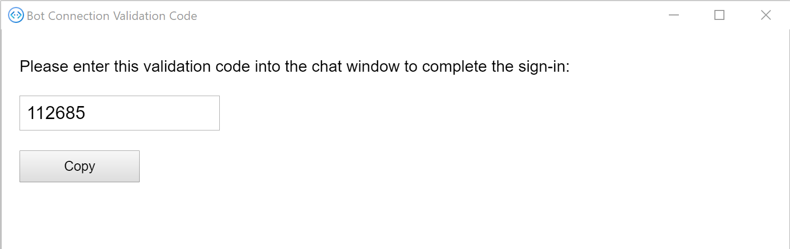

<!-- markdownlint-disable MD002 MD041 -->

<span data-ttu-id="6f27f-101">Neste exercício, você usará o **OAuthPrompt** da estrutura de bot para implementar a autenticação no bot e adquirir tokens de acesso para chamar a API do Microsoft Graph.</span><span class="sxs-lookup"><span data-stu-id="6f27f-101">In this exercise you will use the Bot Framework's **OAuthPrompt** to implement authentication in the bot, and acquire access tokens for calling the Microsoft Graph API.</span></span>

1. <span data-ttu-id="6f27f-102">Abra **./appsettings.js** e faça as seguintes alterações.</span><span class="sxs-lookup"><span data-stu-id="6f27f-102">Open **./appsettings.json** and make the following changes.</span></span>

    - <span data-ttu-id="6f27f-103">Altere o valor de `MicrosoftAppId` para a ID do aplicativo do seu registro de aplicativo do **bot de calendário do gráfico** .</span><span class="sxs-lookup"><span data-stu-id="6f27f-103">Change the value of `MicrosoftAppId` to the application ID of your **Graph Calendar Bot** app registration.</span></span>
    - <span data-ttu-id="6f27f-104">Altere o valor de `MicrosoftAppPassword` para o segredo do cliente de **bot de calendário do gráfico** .</span><span class="sxs-lookup"><span data-stu-id="6f27f-104">Change the value of `MicrosoftAppPassword` to your **Graph Calendar Bot** client secret.</span></span>
    - <span data-ttu-id="6f27f-105">Adicione um valor nomeado `ConnectionName` com um valor de `GraphBotAuth` .</span><span class="sxs-lookup"><span data-stu-id="6f27f-105">Add a value named `ConnectionName` with a value of `GraphBotAuth`.</span></span>

    :::code language="json" source="../demo/GraphCalendarBot/appsettings.example.json":::

    > [!NOTE]
    > <span data-ttu-id="6f27f-106">Se você usou um valor diferente de `GraphBotAuth` para o nome da sua entrada nas **configurações de conexão OAuth** no portal do Azure, use esse valor para a `ConnectionName` entrada.</span><span class="sxs-lookup"><span data-stu-id="6f27f-106">If you used a value other than `GraphBotAuth` for the name of your entry in **OAuth Connection Settings** in the Azure Portal, use that value for the `ConnectionName` entry.</span></span>

## <a name="implement-dialogs"></a><span data-ttu-id="6f27f-107">Implementar caixas de diálogo</span><span class="sxs-lookup"><span data-stu-id="6f27f-107">Implement dialogs</span></span>

1. <span data-ttu-id="6f27f-108">Crie um novo diretório na raiz do projeto chamado caixas de **diálogo**.</span><span class="sxs-lookup"><span data-stu-id="6f27f-108">Create a new directory in the root of the project named **Dialogs**.</span></span> <span data-ttu-id="6f27f-109">Crie um novo arquivo no diretório **./dialogs** chamado **LogoutDialog.cs** e adicione o código a seguir.</span><span class="sxs-lookup"><span data-stu-id="6f27f-109">Create a new file in the **./Dialogs** directory named **LogoutDialog.cs** and add the following code.</span></span>

    :::code language="csharp" source="../demo/GraphCalendarBot/Dialogs/LogoutDialog.cs" id="LogoutDialogSnippet":::

    <span data-ttu-id="6f27f-110">Esta caixa de diálogo fornece uma classe base para todas as outras caixas de diálogo no bot para derivar de.</span><span class="sxs-lookup"><span data-stu-id="6f27f-110">This dialog provides a base class for all of the other dialogs in the bot to derive from.</span></span> <span data-ttu-id="6f27f-111">Isso permite que o usuário faça o logout, não importa onde eles estejam nas caixas de diálogo do bot.</span><span class="sxs-lookup"><span data-stu-id="6f27f-111">This allows the user to log out no matter where they are in the bot's dialogs.</span></span>

1. <span data-ttu-id="6f27f-112">Crie um novo arquivo no diretório **./dialogs** chamado **MainDialog.cs** e adicione o código a seguir.</span><span class="sxs-lookup"><span data-stu-id="6f27f-112">Create a new file in the **./Dialogs** directory named **MainDialog.cs** and add the following code.</span></span>

    ```csharp
    using System.Collections.Generic;
    using System.Threading;
    using System.Threading.Tasks;
    using Microsoft.Bot.Builder;
    using Microsoft.Bot.Builder.Dialogs;
    using Microsoft.Bot.Builder.Dialogs.Choices;
    using Microsoft.Bot.Schema;
    using Microsoft.Extensions.Configuration;
    using Microsoft.Extensions.Logging;

    namespace CalendarBot.Dialogs
    {
        public class MainDialog : LogoutDialog
        {
            const string NO_PROMPT = "no-prompt";
            protected readonly ILogger _logger;

            public MainDialog(IConfiguration configuration, ILogger<MainDialog> logger)
                : base(nameof(MainDialog), configuration["ConnectionName"])
            {
                _logger = logger;

                // OAuthPrompt dialog handles the authentication and token
                // acquisition
                AddDialog(new OAuthPrompt(
                    nameof(OAuthPrompt),
                    new OAuthPromptSettings
                    {
                        ConnectionName = ConnectionName,
                        Text = "Please login",
                        Title = "Login",
                        Timeout = 300000, // User has 5 minutes to login
                    }));

                AddDialog(new ChoicePrompt(nameof(ChoicePrompt)));

                AddDialog(new WaterfallDialog(nameof(WaterfallDialog), new WaterfallStep[]
                {
                    LoginPromptStepAsync,
                    ProcessLoginStepAsync,
                    PromptUserStepAsync,
                    CommandStepAsync,
                    ProcessStepAsync,
                    ReturnToPromptStepAsync
                }));

                // The initial child Dialog to run.
                InitialDialogId = nameof(WaterfallDialog);
            }

            private async Task<DialogTurnResult> LoginPromptStepAsync(
                WaterfallStepContext stepContext,
                CancellationToken cancellationToken)
            {
                // If we're going through the waterfall a second time, don't do an extra OAuthPrompt
                var options = stepContext.Options?.ToString();
                if (options == NO_PROMPT)
                {
                    return await stepContext.NextAsync(cancellationToken: cancellationToken);
                }

                return await stepContext.BeginDialogAsync(nameof(OAuthPrompt), null, cancellationToken);
            }

            private async Task<DialogTurnResult> ProcessLoginStepAsync(
                WaterfallStepContext stepContext,
                CancellationToken cancellationToken)
            {
                // If we're going through the waterfall a second time, don't do an extra OAuthPrompt
                var options = stepContext.Options?.ToString();
                if (options == NO_PROMPT)
                {
                    return await stepContext.NextAsync(cancellationToken: cancellationToken);
                }

                // Get the token from the previous step. If it's there, login was successful
                if (stepContext.Result != null)
                {
                    var tokenResponse = stepContext.Result as TokenResponse;
                    if (!string.IsNullOrEmpty(tokenResponse?.Token))
                    {
                        await stepContext.Context.SendActivityAsync(
                            MessageFactory.Text("You are now logged in."), cancellationToken);
                        return await stepContext.NextAsync(null, cancellationToken);
                    }
                }

                await stepContext.Context.SendActivityAsync(
                    MessageFactory.Text("Login was not successful please try again."), cancellationToken);
                return await stepContext.EndDialogAsync();
            }

            private async Task<DialogTurnResult> PromptUserStepAsync(
                WaterfallStepContext stepContext,
                CancellationToken cancellationToken)
            {
                var options = new PromptOptions
                {
                    Prompt = MessageFactory.Text("Please choose an option below"),
                    Choices = new List<Choice> {
                        new Choice { Value = "Show token" },
                        new Choice { Value = "Show me" },
                        new Choice { Value = "Show calendar" },
                        new Choice { Value = "Add event" },
                        new Choice { Value = "Log out" },
                    }
                };

                return await stepContext.PromptAsync(
                    nameof(ChoicePrompt),
                    options,
                    cancellationToken);
            }

            private async Task<DialogTurnResult> CommandStepAsync(
                WaterfallStepContext stepContext,
                CancellationToken cancellationToken)
            {
                // Save the command the user entered so we can get it back after
                // the OAuthPrompt completes
                var foundChoice = stepContext.Result as FoundChoice;
                // Result could be a FoundChoice (if user selected a choice button)
                // or a string (if user just typed something)
                stepContext.Values["command"] = foundChoice?.Value ?? stepContext.Result;

                // There is no reason to store the token locally in the bot because we can always just call
                // the OAuth prompt to get the token or get a new token if needed. The prompt completes silently
                // if the user is already signed in.
                return await stepContext.BeginDialogAsync(nameof(OAuthPrompt), null, cancellationToken);
            }

            private async Task<DialogTurnResult> ProcessStepAsync(
                WaterfallStepContext stepContext,
                CancellationToken cancellationToken)
            {
                if (stepContext.Result != null)
                {
                    var tokenResponse = stepContext.Result as TokenResponse;

                    // If we have the token use the user is authenticated so we may use it to make API calls.
                    if (tokenResponse?.Token != null)
                    {
                        var command = ((string)stepContext.Values["command"] ?? string.Empty).ToLowerInvariant();

                        if (command.StartsWith("show token"))
                        {
                            // Show the user's token - for testing and troubleshooting
                            // Generally production apps should not display access tokens
                            await stepContext.Context.SendActivityAsync(
                                MessageFactory.Text($"Your token is: {tokenResponse.Token}"),
                                cancellationToken);
                        }
                        else if (command.StartsWith("show me"))
                        {
                            await stepContext.Context.SendActivityAsync(
                                MessageFactory.Text("I don't know how to do this yet!"),
                                cancellationToken);
                        }
                        else if (command.StartsWith("show calendar"))
                        {
                            await stepContext.Context.SendActivityAsync(
                                MessageFactory.Text("I don't know how to do this yet!"),
                                cancellationToken);
                        }
                        else if (command.StartsWith("add event"))
                        {
                            await stepContext.Context.SendActivityAsync(
                                MessageFactory.Text("I don't know how to do this yet!"),
                                cancellationToken);
                        }
                        else
                        {
                            await stepContext.Context.SendActivityAsync(
                                MessageFactory.Text("I'm sorry, I didn't understand. Please try again."),
                                cancellationToken);
                        }
                    }
                }
                else
                {
                    await stepContext.Context.SendActivityAsync(
                        MessageFactory.Text("We couldn't log you in. Please try again later."),
                        cancellationToken);
                    return await stepContext.EndDialogAsync(cancellationToken: cancellationToken);
                }

                // Go to the next step
                return await stepContext.NextAsync(cancellationToken: cancellationToken);
            }

            private async Task<DialogTurnResult> ReturnToPromptStepAsync(
                WaterfallStepContext stepContext,
                CancellationToken cancellationToken)
            {
                // Restart the dialog, but skip the initial login prompt
                return await stepContext.ReplaceDialogAsync(InitialDialogId, NO_PROMPT, cancellationToken);
            }
        }
    }
    ```

    <span data-ttu-id="6f27f-113">Reserve um tempo para revisar esse código.</span><span class="sxs-lookup"><span data-stu-id="6f27f-113">Take a moment to review this code.</span></span>

    - <span data-ttu-id="6f27f-114">No construtor, ele configura um [WaterfallDialog](https://docs.microsoft.com/azure/bot-service/bot-builder-concept-waterfall-dialogs?view=azure-bot-service-4.0) com um conjunto de etapas que ocorrem na ordem.</span><span class="sxs-lookup"><span data-stu-id="6f27f-114">In the constructor, it sets up a [WaterfallDialog](https://docs.microsoft.com/azure/bot-service/bot-builder-concept-waterfall-dialogs?view=azure-bot-service-4.0) with a set of steps that occur in order.</span></span>
        - <span data-ttu-id="6f27f-115">`LoginPromptStepAsync`Ele envia um **OAuthPrompt**.</span><span class="sxs-lookup"><span data-stu-id="6f27f-115">In `LoginPromptStepAsync` it sends an **OAuthPrompt**.</span></span> <span data-ttu-id="6f27f-116">Se o usuário não estiver conectado, enviará um prompt da interface do usuário para o usuário.</span><span class="sxs-lookup"><span data-stu-id="6f27f-116">If the user isn't logged in, this will send a UI prompt to the user.</span></span>
        - <span data-ttu-id="6f27f-117">`ProcessLoginStepAsync`Ele verifica se o logon foi bem-sucedido e envia uma confirmação.</span><span class="sxs-lookup"><span data-stu-id="6f27f-117">In `ProcessLoginStepAsync` it checks if the login was successful and sends a confirmation.</span></span>
        - <span data-ttu-id="6f27f-118">`PromptUserStepAsync`Ele envia um **ChoicePrompt** com os comandos disponíveis.</span><span class="sxs-lookup"><span data-stu-id="6f27f-118">In `PromptUserStepAsync` it sends a **ChoicePrompt** with the available commands.</span></span>
        - <span data-ttu-id="6f27f-119">`CommandStepAsync`Ele salva a opção do usuário e, em seguida, envia novamente um **OAuthPrompt**.</span><span class="sxs-lookup"><span data-stu-id="6f27f-119">In `CommandStepAsync` it saves the user's choice, then resends an **OAuthPrompt**.</span></span>
        - <span data-ttu-id="6f27f-120">`ProcessStepAsync`Ele executa ações com base no comando recebido.</span><span class="sxs-lookup"><span data-stu-id="6f27f-120">In `ProcessStepAsync` it takes action based on the command received.</span></span>
        - <span data-ttu-id="6f27f-121">No `ReturnToPromptStepAsync` início da cascata, mas passa um sinalizador para ignorar o logon de usuário inicial.</span><span class="sxs-lookup"><span data-stu-id="6f27f-121">In `ReturnToPromptStepAsync` it starts the waterfall over, but passes a flag to skip the initial user login.</span></span>

## <a name="update-calendarbot"></a><span data-ttu-id="6f27f-122">Atualizar CalendarBot</span><span class="sxs-lookup"><span data-stu-id="6f27f-122">Update CalendarBot</span></span>

<span data-ttu-id="6f27f-123">A próxima etapa é atualizar o **CalendarBot** para usar essas novas caixas de diálogo.</span><span class="sxs-lookup"><span data-stu-id="6f27f-123">The next step is to update **CalendarBot** to use these new dialogs.</span></span>

1. <span data-ttu-id="6f27f-124">Abra **./bots/CalendarBot.cs** e substitua todo o conteúdo pelo código a seguir.</span><span class="sxs-lookup"><span data-stu-id="6f27f-124">Open **./Bots/CalendarBot.cs** and replace its entire contents with the following code.</span></span>

    :::code language="csharp" source="../demo/GraphCalendarBot/Bots/CalendarBot.cs" id="CalendarBotSnippet":::

    <span data-ttu-id="6f27f-125">Veja um breve resumo das alterações.</span><span class="sxs-lookup"><span data-stu-id="6f27f-125">Here's a brief summary of the changes.</span></span>

    - <span data-ttu-id="6f27f-126">Foi alterada a classe **CalendarBot** para ser uma classe de modelo, recebendo uma **caixa de diálogo**.</span><span class="sxs-lookup"><span data-stu-id="6f27f-126">Changed the **CalendarBot** class to be a template class, receiving a **Dialog**.</span></span>
    - <span data-ttu-id="6f27f-127">Foi alterada a classe **CalendarBot** para estender o **TeamsActivityHandler**, permitindo que ele entre no Microsoft Teams.</span><span class="sxs-lookup"><span data-stu-id="6f27f-127">Changed the **CalendarBot** class to extend **TeamsActivityHandler**, allowing it to sign in in Microsoft Teams.</span></span>
    - <span data-ttu-id="6f27f-128">Foram adicionadas substituições de métodos adicionais para habilitar a autenticação.</span><span class="sxs-lookup"><span data-stu-id="6f27f-128">Added additional method overrides to enable authentication.</span></span>

## <a name="update-startupcs"></a><span data-ttu-id="6f27f-129">Atualizar Startup.cs</span><span class="sxs-lookup"><span data-stu-id="6f27f-129">Update Startup.cs</span></span>

<span data-ttu-id="6f27f-130">A etapa final é atualizar o `ConfigureServices` método para adicionar os serviços necessários para autenticação e a nova caixa de diálogo.</span><span class="sxs-lookup"><span data-stu-id="6f27f-130">The final step is to update the `ConfigureServices` method to add the services needed for authentication and the new dialog.</span></span>

1. <span data-ttu-id="6f27f-131">Abra **./Startup.cs** e remova a `services.AddTransient<IBot, Bots.CalendarBot>();` linha do `ConfigureServices` método.</span><span class="sxs-lookup"><span data-stu-id="6f27f-131">Open **./Startup.cs** and remove the `services.AddTransient<IBot, Bots.CalendarBot>();` line from the `ConfigureServices` method.</span></span>

1. <span data-ttu-id="6f27f-132">Insira o código a seguir no final do `ConfigureServices` método.</span><span class="sxs-lookup"><span data-stu-id="6f27f-132">Insert the following code at the end of the `ConfigureServices` method.</span></span>

    :::code language="csharp" source="../demo/GraphCalendarBot/Startup.cs" id="ConfigureServiceSnippet":::

## <a name="test-authentication"></a><span data-ttu-id="6f27f-133">Autenticação de teste</span><span class="sxs-lookup"><span data-stu-id="6f27f-133">Test authentication</span></span>

1. <span data-ttu-id="6f27f-134">Salve todas as suas alterações e inicie o bot com o `dotnet run` .</span><span class="sxs-lookup"><span data-stu-id="6f27f-134">Save all of your changes and start the bot with `dotnet run`.</span></span>

1. <span data-ttu-id="6f27f-135">Abra o emulador da estrutura do bot.</span><span class="sxs-lookup"><span data-stu-id="6f27f-135">Open the Bot Framework Emulator.</span></span> <span data-ttu-id="6f27f-136">Selecione o menu **arquivo** e, em seguida, **nova configuração de bot...**.</span><span class="sxs-lookup"><span data-stu-id="6f27f-136">Select the **File** menu, then **New Bot Configuration...**.</span></span>

1. <span data-ttu-id="6f27f-137">Preencha os campos da seguinte maneira.</span><span class="sxs-lookup"><span data-stu-id="6f27f-137">Fill in the fields as follows.</span></span>

    - <span data-ttu-id="6f27f-138">**Nome do bot:**`CalendarBot`</span><span class="sxs-lookup"><span data-stu-id="6f27f-138">**Bot name:** `CalendarBot`</span></span>
    - <span data-ttu-id="6f27f-139">**URL do ponto de extremidade:**`https://localhost:3978/api/messages`</span><span class="sxs-lookup"><span data-stu-id="6f27f-139">**Endpoint URL:** `https://localhost:3978/api/messages`</span></span>
    - <span data-ttu-id="6f27f-140">ID do aplicativo da **Microsoft:** a ID de aplicativo do seu registro de aplicativo do **bot de calendário de gráfico**</span><span class="sxs-lookup"><span data-stu-id="6f27f-140">**Microsoft App ID:** the application ID of your **Graph Calendar Bot** app registration</span></span>
    - <span data-ttu-id="6f27f-141">**Senha do Microsoft App:** seu segredo do cliente de **bot de calendário gráfico**</span><span class="sxs-lookup"><span data-stu-id="6f27f-141">**Microsoft App password:** your **Graph Calendar Bot** client secret</span></span>
    - <span data-ttu-id="6f27f-142">**Criptografar chaves armazenadas na sua configuração de bot:** Permiti</span><span class="sxs-lookup"><span data-stu-id="6f27f-142">**Encrypt keys stored in your bot configuration:** Enabled</span></span>

    

1. <span data-ttu-id="6f27f-144">Selecione **salvar e conectar**.</span><span class="sxs-lookup"><span data-stu-id="6f27f-144">Select **Save and connect**.</span></span> <span data-ttu-id="6f27f-145">Depois que o emulador se conectar, você verá `Welcome to Microsoft Graph CalendarBot. Type anything to get started.`</span><span class="sxs-lookup"><span data-stu-id="6f27f-145">After the emulator connects, you should see `Welcome to Microsoft Graph CalendarBot. Type anything to get started.`</span></span>

1. <span data-ttu-id="6f27f-146">Digite algum texto e envie-o ao bot.</span><span class="sxs-lookup"><span data-stu-id="6f27f-146">Type some text and send it to the bot.</span></span> <span data-ttu-id="6f27f-147">O bot responde com um prompt de logon.</span><span class="sxs-lookup"><span data-stu-id="6f27f-147">The bot responds with a login prompt.</span></span>

1. <span data-ttu-id="6f27f-148">Selecione o botão de **logon** .</span><span class="sxs-lookup"><span data-stu-id="6f27f-148">Select the **Login** button.</span></span> <span data-ttu-id="6f27f-149">O emulador solicita que você confirme a URL que começa com `oauthlink://https://token.botframeworkcom` .</span><span class="sxs-lookup"><span data-stu-id="6f27f-149">The emulator prompts you to confirm the URL that starts with `oauthlink://https://token.botframeworkcom`.</span></span> <span data-ttu-id="6f27f-150">Selecione **confirmar** para continuar.</span><span class="sxs-lookup"><span data-stu-id="6f27f-150">Select **Confirm** to continue.</span></span>

1. <span data-ttu-id="6f27f-151">Na janela pop-up, faça logon com sua conta do Microsoft 365.</span><span class="sxs-lookup"><span data-stu-id="6f27f-151">In the pop-up window, login with your Microsoft 365 account.</span></span> <span data-ttu-id="6f27f-152">Revise as permissões solicitadas e aceite.</span><span class="sxs-lookup"><span data-stu-id="6f27f-152">Review the requested permissions and accept.</span></span>

1. <span data-ttu-id="6f27f-153">Após a conclusão da autenticação e do consentimento, a janela pop-up fornece um código de validação.</span><span class="sxs-lookup"><span data-stu-id="6f27f-153">Once authentication and consent are complete, the pop-up window provides a validation code.</span></span> <span data-ttu-id="6f27f-154">Copie o código e feche a janela.</span><span class="sxs-lookup"><span data-stu-id="6f27f-154">Copy the code and close the window.</span></span>

    

1. <span data-ttu-id="6f27f-156">Insira o código de validação na janela chat para concluir o logon.</span><span class="sxs-lookup"><span data-stu-id="6f27f-156">Enter the validation code in the chat window to complete the login.</span></span>

    

1. <span data-ttu-id="6f27f-158">Se você selecionar o botão **Mostrar token** (ou tipo `show token` ), o bot exibirá o token de acesso.</span><span class="sxs-lookup"><span data-stu-id="6f27f-158">If you select the **Show token** button (or type `show token`), the bot displays the access token.</span></span> <span data-ttu-id="6f27f-159">O botão **fazer** logout (ou digitar `log out` ) fará logout.</span><span class="sxs-lookup"><span data-stu-id="6f27f-159">The **Log out** button (or typing `log out`) will log you out.</span></span>

> [!TIP]
> <span data-ttu-id="6f27f-160">Você pode receber a seguinte mensagem de erro no emulador da estrutura do bot ao iniciar uma conversa com o bot.</span><span class="sxs-lookup"><span data-stu-id="6f27f-160">You may receive the following error message in the Bot Framework Emulator when starting a conversation with the bot.</span></span>
>
> ```text
> Failed to generate an actual sign-in link: Error: Failed to connect to ngrok instance for OAuth postback URL:
> FetchError: request to http://127.0.0.1:4041/api/tunnels failed, reason: connect ECONNREFUSED 127.0.0.1:4041
> ```
>
> <span data-ttu-id="6f27f-161">Se isso acontecer, feche o emulador e reinicie-o.</span><span class="sxs-lookup"><span data-stu-id="6f27f-161">If this happens, close the emulator and restart it.</span></span>
