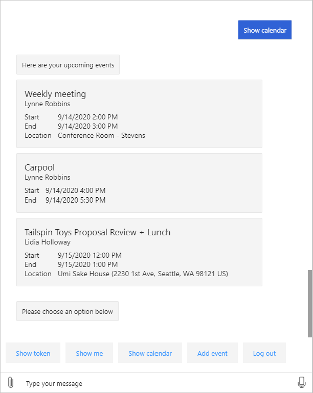

<!-- markdownlint-disable MD002 MD041 -->

Nesta seção, você usará o SDK do Microsoft Graph para obter os três próximos eventos no calendário do usuário da semana atual.In this section you'll use the Microsoft Graph SDK to get the next 3 upcoming events on the user's calendar for the current week.

## Obter um modo de exibição de calendárioGet a calendar view

Um modo de exibição de calendário é uma lista de eventos no calendário de um usuário que está entre dois valores de data/hora.A calendar view is a list of events on a user's calendar that fall between two date/time values. A vantagem de usar um modo de exibição de calendário é que ele inclui qualquer ocorrência de reuniões recorrentes.The advantage of using a calendar view is that it includes any occurrences of recurring meetings.

1. Abra **./CardHelper.cs** e adicione a função a seguir à classe **CardHelper** .Open **./CardHelper.cs** and add the following function to the **CardHelper** class.

    :::code language="csharp" source="../demo/GraphCalendarBot/CardHelper.cs" id="GetEventCardSnippet":::

    Este código cria um cartão adaptável para renderizar um evento de calendário.This code builds an Adaptive Card to render a calendar event.

1. Abra **./dialogs/MainDialog.cs** e adicione a função a seguir à classe **MainDialog** .Open **./Dialogs/MainDialog.cs** and add the following function to the **MainDialog** class.

    :::code language="csharp" source="../demo/GraphCalendarBot/Dialogs/MainDialog.cs" id="DisplayCalendarViewSnippet":::

    Considere o que esse código faz.Consider what this code does.

    - Ele obtém o **MailboxSettings** do usuário para determinar o fuso horário preferencial do usuário e os formatos de data/hora.It gets the user's **MailboxSettings** to determine the user's preferred time zone and date/time formats.
    - Ele define os valores **StartDateTime** e **EndDateTime** como agora e o final da semana, respectivamente.It sets the **startDateTime** and **endDateTime** values to now and the end of the week, respectively. Isso define a janela de tempo que o modo de exibição de calendário usa.This defines the window of time that the calendar view uses.
    - Ele chama `graphClient.Me.CalendarView` os seguintes detalhes.It calls `graphClient.Me.CalendarView` with the following details.
        - Ele define o `Prefer: outlook.timezone` cabeçalho para o fuso horário preferencial do usuário, fazendo com que as horas de início e de término dos eventos estejam no fuso horário do usuário.It sets the `Prefer: outlook.timezone` header to the user's preferred time zone, causing the start and end times for the events to be in the user's timezone.
        - Ele usa o `Top(3)` método para limitar os resultados apenas aos três primeiros eventos.It uses the `Top(3)` method to limit the results to only the first 3 events.
        - Ele usa `Select` para limitar os campos retornados apenas aos campos usados pelo bot.It uses `Select` to limit the fields returned to just those fields used by the bot.
        - Ele usa `OrderBy` para classificar os eventos por hora de início.It uses `OrderBy` to sort the events by start time.
    - Ele adiciona um cartão adaptável para cada evento à mensagem de resposta.It adds an Adaptive Card for each event to the reply message.

1. Substitua o código dentro do `else if (command.StartsWith("show calendar"))` bloco em `ProcessStepAsync` com o seguinte.Replace the code inside the `else if (command.StartsWith("show calendar"))` block in `ProcessStepAsync` with the following.

    :::code language="csharp" source="../demo/GraphCalendarBot/Dialogs/MainDialog.cs" id="ShowCalendarSnippet" highlight="3":::

1. Salve todas as suas alterações e reinicie o bot.Save all of your changes and restart the bot.

1. Use o emulador da estrutura de bot para se conectar ao bot e fazer logon.Use the Bot Framework Emulator to connect to the bot and log in. Selecione o botão **Mostrar calendário** para exibir o modo de exibição calendário.Select the **Show calendar** button to display the calendar view.

    
